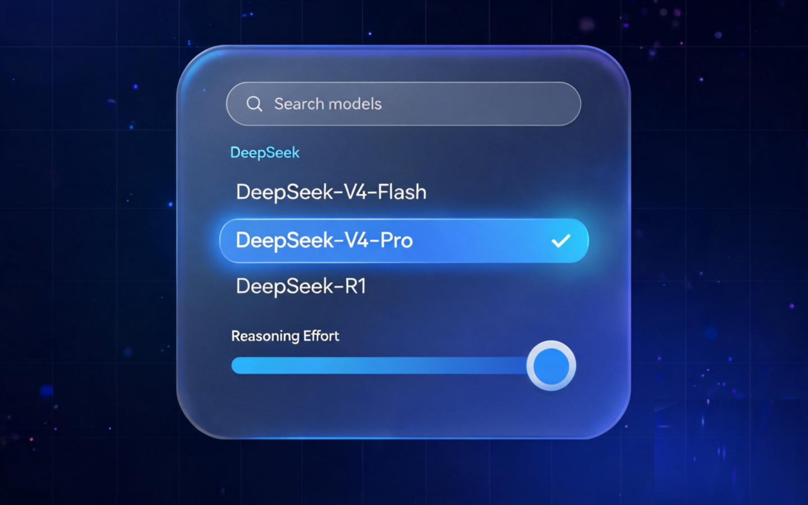
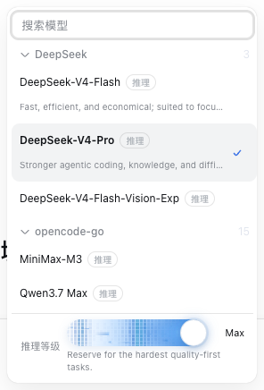
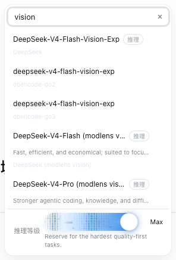

# @bittersmilezzz/dsh-model-selector

<p align="center">
  
</p>

**增强模型选择器（Model Selector）** —— DeepSeek Harness (DSH) 的**增强模型选择器**：单层菜单（搜索 + 分组）+ 底部内联推理强度（Reasoning Effort）滑杆。从 dsh-ui-tweaks 按功能拆分出的独立插件包。

## 界面预览

默认菜单（分组折叠 + 推理滑杆） | 搜索过滤（跨供应商同名模型带供应商标）
:---: | :---:
 | 

## 功能

- 替换官方输入区的模型选择 seat（`conversation.input.model`，shadow 方式叠加，不禁用官方组件）
- 单层模型菜单：名称搜索过滤（命中片段高亮）+ 提供商分组折叠，选中行与供应商标可见高亮，打开自动滚到当前选中行
- 搜索宽容：大小写、变音符与 `İ`/`café` 这类 Unicode 折叠差异都能命中（NFKD 归一化；高亮只在码位长度不变时标注，不画错位置）
- 菜单高度按视口实测钳位，弹出方向自适应（取上下空间更大一侧），矮窗口自动收不溢出；seat 右缘放不下时水平钳到视口内
- 键盘可完整操作：方向键在结果间移动、搜索框内 Enter 选中首个命中、Escape 先清搜索词再关闭并还原焦点；IME 组合输入的确认键不会被误当成「选中首个命中」
- 无障碍：搜索框是 combobox（结果列表 listbox / 分组视图 menu）、roving tabindex 只留一个 Tab 停靠点（全折叠时落在组头）、焦点指示与选中态可辨、状态变化经常驻 live region 播报
- 选中模型后可展开底部内联**推理强度滑杆**，实时显示当前档位名与该档位说明
- 切换被宿主拒绝时，失败原因用官方 Toast 在输入区上方播报（菜单已关闭也能看到）
- 选择推理模型会自动落到**最强思考档**（仅限已知档位；适配器自造档位不猜），并在成功后提示落到的档位（行上有「推理」标记说明）
- 与 `/model` 弹窗共用官方 `modelDirectories` 目录，两处实时同步

## 安装

```bash
# npm（推荐）：包名 @bittersmilezzz/dsh-model-selector
dsh plugin --profile <profile> add @bittersmilezzz/dsh-model-selector
# 或从 GitHub
dsh plugin --profile <profile> add github:bitterSmilezzz/dsh-model-selector
# 或本地路径
dsh plugin --profile <profile> add <path-to-repo>
```

启用后刷新浏览器页面（web profile），模型选择器即替换输入区原 seat。

## 配置

无设置项（纯 UI 插件），不占用「设置 → 插件 → 配置」卡片位。

## 外部依赖

- macOS / Windows / Linux 通用，无系统级依赖。
- 运行时依赖 DSH web profile（client 半区），需要 `@deepseek-ai/dsh-client-ui-slots` 等官方注入包（见 package.json peerDependencies）。
- 生命周期脚本：**无**（无 preinstall/install/postinstall/prepare）。

## 权限

**权限等级：low**。纯 client UI：不注册 host 工具、不读写宿主文件、不访问凭据、不发起自有网络请求。

模型目录与切换动作走**官方 session RPC**（`ctx.remote.session` 的目录加载与 `selectModel`），与官方模型选择器使用同一条通道、同一份 `modelDirectories` 目录状态；除此之外不与宿主通信。UI 反馈（Toast、图标、浮层定位）运行时复用官方 `@deepseek-ai/dsh-client-ui-primitives`。

## 已知风险

- 通过 slot 优先级（priority: -1）**shadow 官方 seat**：若官方后续改动该 seat 的注入面（`ModelSelectInjected`），需同步适配；这是官方认可的 slot 叠加机制，并非禁用官方 entry。
- 与其它也 shadow `conversation.input.model` 的插件同时安装时，优先级决定渲染赢家，可能互相覆盖（本插件优先级 -1 最低，默认胜出）。
- 遮蔽的**依赖侧**已由 `test/official-seat-shadow.test.mjs` 钉住：官方当前注册该座位时**不声明** `priority`（即默认 0），遮蔽才成立；官方一旦开始声明（尤其 `<= -1`）或把该座位从 single 改成 chain，测试先变红，提示重新评估策略。
- 若把这个插件提交到第三方商城（如 DSH-Store），其「不动官方组件」条款是最需要解释的一点：本插件走的是官方 slot 的 shadowing 语义（`priority: -1`），**没有**禁用/替换官方 entry，也没有改动任何 `@deepseek-ai/*` 组件本体。

## 开发

标准双半区结构，`lib/` 为构建产物（**入库**：CI 会校验重建结果与提交一致）：

```bash
pnpm install
pnpm typecheck          # 双 program（host + client）
pnpm build              # tsc host + tsdown client bundle + client d.ts
pnpm test               # node --test（纯函数 + 产物/契约门禁）
pnpm validate:registry  # 上架前自检（当前 = pnpm test）
```

纯函数模块与调优常量（含义与调法见各常量旁注释）：

| 位置 | 内容 |
| --- | --- |
| `src/client/ModelSelect.tsx` 顶部 | `DIRECTORY_STALE_MS` / `MAX_VISIBLE_HITS` / `EFFORT_COMMIT_TIMEOUT_MS` |
| `src/client/menuFit.ts` | `MENU_MAX_HEIGHT` / `MENU_VIEWPORT_MARGIN` |
| `src/client/effortCanvas.ts` | `DRAG_EASE` / `IDLE_EASE` / `SETTLE_EPSILON`（辐射特效手感） |
| `src/client/effort.ts` | `EFFORT_RANK`（档位强弱序，决定「最强思考档」） |

`search.ts`（折叠匹配/命中窗口/空态）、`keys.ts`（键盘状态机）、`copy.ts`（trigger
文案链）、`roving.ts`（行键与 Tab 落点）都是纯函数模块，`node --test` 直接跑源码。

刻意不做配置化——纯 UI 插件无 settings namespace，不为此引入配置基建。

改完源码必须 `pnpm build` 并提交 `lib/`：CI（`.github/workflows/ci.yml`）会跑
`pnpm build && git diff --exit-code -- lib`，入库产物与重建结果不一致即失败
（测试里也钉了源码内容指纹，本地 `pnpm test` 即可发现「改了源码没重建」）。

## License

MIT